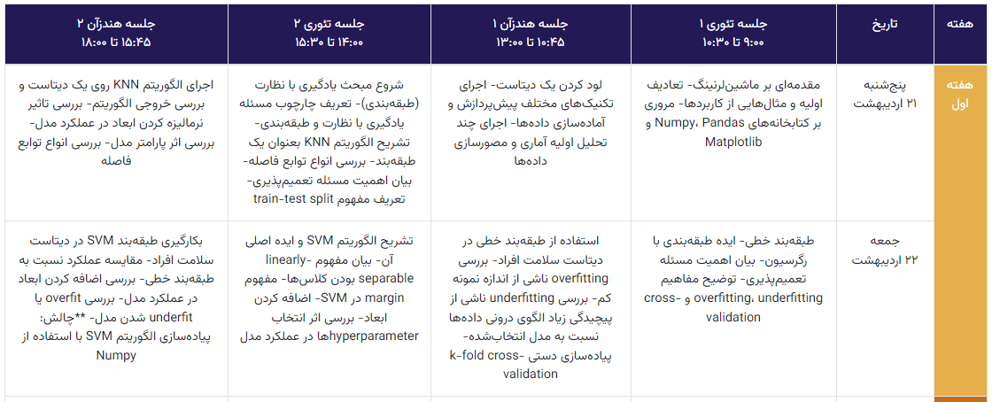

# divar1
scraping data from a website using the **requests** and **BeautifulSoup** libraries, performing some text processing using the **arabic_reshaper** and [**bidi**](https://github.com/MeirKriheli/python-bidi) libraries, and then printing items based on a condition.

